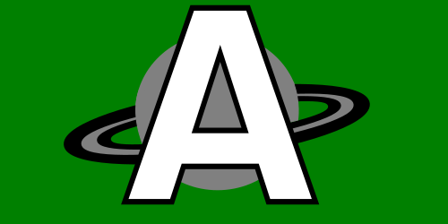
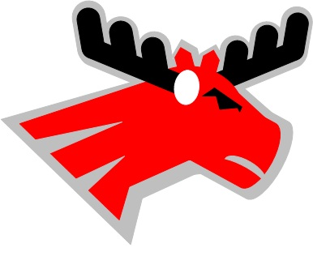

# ALPINE-CASCADIA FOOTBALL LEAGUE  

The Alpine-Cascadia Football League (ACFL) is an imaginary football league created by Nick Loucks. It evolved from a dice-based football game he developed for his stuffed animals when he was a kid. The latest version of the league features a third-party football simulation video game to simulate the individual games played and to generate statistics for the different players and teams in the league. The ACFL website features a blog of the latest news and game analysis, player and teams stats, league and conference standings, and even recorded footage of the games.

>domain: [alpine-cascadia-football.com](alpine-cascadia-football.com)

## Conferences:  
- <u>**Marine Conference**</u> (MC)  
    - championship game: _Anchor Bowl_  
- <u>**Spruce Conference**</u> (SC)  
    - championship game: _Ax Bowl_

## Playoffs:  
The two conferences each determine a champion at the end of the regular season by hosting a single-elimination conference championship game between the top two eligble teams. The two conference champions will face off in the final bowl game, the _Alpine Bowl_, to determine the year's League Champion. Conference championship games are played at the home stadium of the team with the better conference record, whereas the _Alpine Bowl_ is always played at a neutral site: Windsor City stadium. In addition to the _Anchor_, _Ax_, and _Alpine_ Bowls, the _Pine Bowl_ is hosted each postseason as a premier matchup between the top two eligbile "at-large" teams not selected to thier respective conference championship games for the year.

## ACFT:  
Each year, the ACFL hosts a league-wide single-elimination tournament before the regular season with seeding based on final league standings of the previous year. The winner of the tournament receives the Cedar Cup trophy. Game results from this tournament do not affect the regular season conference standings nor playoff invitations. Notably however, the games are not considered simply exhibition games, as the results are counted towards the teams' all-time club statistics and records, as well as the rankings throughout the year.

---

- sample logo 1 png  

- sample logo 2 

---
# Design Decisions:  

## Architecture:  
The ACFL willl generally use some variation of "Clean Architecture" as defined by "Uncle Bob", and possibly include elements from "ports and adapters" and/or "hexagonal architectutre" approaches. I like the flexibility that this will provide me by allowing me to delay and/or change my decisions on what concrete tools/infrastructure to use. With these general strategies towards architecture (particularly the "Dependency Inversion Principle"), I can keep my domain/application logic separate and clean and easily testable, and treat other things like database or web framework integrations as implementation details that can be changed without affecting my core application.  

## Data Modeling:  
Considering [CQRS](https://learn.microsoft.com/en-us/azure/architecture/patterns/cqrs)  

Might use "[Event Sourcing](https://www.geeksforgeeks.org/system-design/event-sourcing-pattern/) pattern" for single play/down events in game simulations. This will manke fine-grained analysis of in-game stats easier with what is effectively an audit trail. Player and Team stats will have an immutable audit-trail as well; for these, the playyer or team's aggregate stats from a full game being the smallest level of granularity. Season-long representations of player or team stats can then be calculated from these and need not be stored separately, but rather can be dynamically calculated/queried and then displayed.  

Game/Match Events will progress through multiple states and will be mutated/updated along the way until the game/match result is finalized, at which point it will become read-only.

## Infrastructure:  
### Data Persistence:  
I will likely be using a relational, SQL-based database (SQLite3 and PostgreSQL are my top choices) to store some of my core objects such as Teams, Players, GameStatLines, and other things that can be organized with relational tables. For other things like Tournament representations, I might choose to use a graph-based, file-based, or NoSQL type of database to better take advantage of their features potentially aligning well with those data structures. Since I am trying to stick to the DIP principle, I have the luxury of postponing this decision until after the core application logic is mostly already implemented.  

### User Interface:  
I am primarily thinking of this project as a web application with server-side rendering. I believe this will keep a lot of things simpler than using a big Javascript framework of some sort and transferring a lot of processing to the browser. In some ways, using SSR will make it easier to keep the application secure from things like XSS and to implement secure authentication as well. Additionally, I can then write a larger majority of my code in Golang, meaning I can reduce context switching between languages, and keep most of my logic in a strongly-typed language and take advantage of a compiler to catch a lot of potential bugs before they become runtime issues. If I later decide to make a desktop application instead of or in addition to a web app, I can still compile my Go code for a set of target OS/Arch combinations. 

